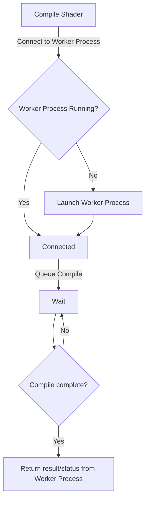

<!--  -->

# C interface for HLSL compiler as a library

* Proposal: [0016](0016-c-interface-compiler-library.md)
* Author(s): [Cooper Partin](https://github.com/coopp)
* Sponsor: [Cooper Partin](https://github.com/coopp)
* Status: **Under Consideration**
* Impacted Project(s): (Clang)

* Issues:
  [#63631](https://github.com/llvm/llvm-project/issues/63631)

## Introduction

An effort is underway to modernize compilation of HLSL based shaders by adding
HLSL compilation to clang. This effort is a long term play that positions
HLSL shader compilation in a place that provides the most stability and
maintainability for the future by giving as many options to DirectX while the
GPU/NPU landscape evolves.

There are multiple ways to compile a shader today.
* dxc.exe - Executable that takes command line options and outputs bytecode
* IDxc** interfaces - COM-based library that is consumed by toolchains to
compile shaders.

## Motivation

One of the HLSL compiler's primary usage modes is as a library. The clang
compiler will also need to expose a library for toolchains to compile a shader.

## Proposed solution

The existing HLSL compiler's library support on Windows is COM based.
This is a non-starter for clang.  COM doesn't fit any of the
existing patterns and is considered to be a Windows-only thing.  Many
developers do not like COM and are immediately turned off on seeing it as a 
requirement.

A better fit in the clang architecture will be to introduce a library with one
or more c style exports to perform compilation tasks.

This export could be part of an existing shared library exposed from clang
(example: libClang, libTooling, etc) or a completely new library that is HLSL
specific. (example: libHlsl, libCompile).

Support for [legacy HLSL compiler toolchains](#alternatives-considered-for-supporting-legacy-toolchains)
will also be addressed in this proposal. The design will help migration of
older DXC-based solutions to adopt clang as the preferred HLSL compiler.

## Detailed design

[Architecture](#architecture)

### What is provided today in the DXC api?
The current DirectX shader compiler library is a nano-COM implementation that
supports the following features.

* [Include Handlers](#include-handlers)
* [Compiler](#shader-compiler)
* [Linker](#shader-linker)
* [Validation](#shader-validation)
* [Reflection Data Access](#shader-reflection)
* [DXIL Container Access](#dxil-container-access)
* [PDB Symbol Access](#shader-pdbs)
* [Intellisense Apis](#intellisense)

These features will also need to be supported by the new c-style library.
Code snippets on how to use the COM library are located
in [DXC api code snippets](#dxc-code-snippets).

### DXC Library Api descriptions and code snippets

The following interfaces are used to work with data being passed to/from the
DXC library.

#### Buffers

```c++
// Encoding defines to use with DxcBuffer
// For convenience, equivalent definitions to CP_UTF8 and CP_UTF16.
#define DXC_CP_UTF8 65001
#define DXC_CP_UTF16 1200
// Use DXC_CP_ACP for: Binary;  ANSI Text;  Autodetect UTF with BOM
#define DXC_CP_ACP 0

// Structure for supplying bytes or text input to Dxc APIs. Represents both
// text (DxcText) and non-text byte buffers (DxcBuffer).
struct DxcBuffer {
  LPCVOID Ptr;
  SIZE_T Size;
  UINT Encoding;
};
typedef DxcBuffer DxcText;

// General purpose buffers
struct IDxcBlob : public IUnknown {
public:
  LPVOID GetBufferPointer();
  SIZE_T GetBufferSize();
};

// String buffers that guarantee null-terminated text and the stated encoding
struct IDxcBlobEncoding : public IDxcBlob {
public:
  HRESULT GetEncoding(BOOL *pKnown, UINT32 *pCodePage);
};

struct IDxcBlobUtf16 : public IDxcBlobEncoding {
public:
  LPCWSTR GetStringPointer();
  SIZE_T GetStringLength();
};

struct IDxcBlobUtf8 : public IDxcBlobEncoding {
public:
  LPCSTR GetStringPointer();
  SIZE_T GetStringLength();
};
```

#### Status and other data
Errors, status, and other kinds of data are returned as an IDxcResult
interface. A unique DXC_OUT_KIND is defined for each different type of data
being returned.  The type of data is determined by the interface method used to
produce the IDxcResult.

Example:
IDxcCompiler3::Compile() and IDxcCompiler3::Disassemble() both return an 
IDxcResult.

```c++
typedef enum DXC_OUT_KIND {
  DXC_OUT_NONE = 0,
  DXC_OUT_OBJECT = 1,         // IDxcBlob - Shader or library object
  DXC_OUT_ERRORS = 2,         // IDxcBlobUtf8 or IDxcBlobUtf16
  DXC_OUT_PDB = 3,            // IDxcBlob
  DXC_OUT_SHADER_HASH = 4,    // IDxcBlob - DxcShaderHash of shader or shader
                              // with source info (-Zsb/-Zss)
  DXC_OUT_DISASSEMBLY = 5,    // IDxcBlobUtf8/16 - from Disassemble
  DXC_OUT_HLSL = 6,           // IDxcBlobUtf8/16 - from Preprocessor or Rewriter
  DXC_OUT_TEXT = 7,           // IDxcBlobUtf8/16 - other text, such as -ast-dump
                              // or -Odump
  DXC_OUT_REFLECTION = 8,     // IDxcBlob - RDAT part with reflection data
  DXC_OUT_ROOT_SIGNATURE = 9, // IDxcBlob - Serialized root signature output
  DXC_OUT_EXTRA_OUTPUTS  = 10,// IDxcExtraResults - Extra outputs

  DXC_OUT_FORCE_DWORD = 0xFFFFFFFF
} DXC_OUT_KIND;

struct IDxcOperationResult : public IUnknown {
  HRESULT GetStatus(HRESULT *pStatus);
};

struct IDxcResult : public IDxcOperationResult {
  BOOL HasOutput(DXC_OUT_KIND dxcOutKind);
  HRESULT GetOutput(DXC_OUT_KIND dxcOutKind,
                    REFIID iid, void **ppvObject,
                    IDxcBlobUtf16 **ppOutputName);
  UINT32 GetNumOutputs();
  DXC_OUT_KIND GetOutputByIndex(UINT32 Index);
  DXC_OUT_KIND PrimaryOutput();
};
```

#### IDxcUtils
The shader compiler library also provides a set of utility functions via
IDxcUtils. This can be used to create/consume the different data in the forms
referred to above. It is obtained by calling DxcCreateInstance().

```c++
com_ptr<IDxcUtils> utils;
check_hresult(DxcCreateInstance(CLSID_DxcUtils, IID_PPV_ARGS(utils.put())));
```

```c++
struct IDxcUtils : public IUnknown {
  // Create a sub-blob that holds a reference to the outer blob and points to
  // its memory.
  HRESULT CreateBlobFromBlob(
    IDxcBlob *pBlob,
    UINT32 offset,
    UINT32 length,
    IDxcBlob **ppResult);

  // Creates a blob referencing existing memory, with no copy.
  HRESULT CreateBlobFromPinned(
    LPCVOID pData,
    UINT32 size,
    UINT32 codePage,
    IDxcBlobEncoding **pBlobEncoding);

  // Create blob, taking ownership of memory allocated with supplied allocator.
  HRESULT MoveToBlob(
    LPCVOID pData,
    IMalloc *pIMalloc,
    UINT32 size,
    UINT32 codePage,
    IDxcBlobEncoding **pBlobEncoding);

  // Copy blob contents to memory owned by the new blob.
  HRESULT CreateBlob(
    LPCVOID pData,
    UINT32 size,
    UINT32 codePage,
    IDxcBlobEncoding **pBlobEncoding);

  HRESULT LoadFile(
    LPCWSTR pFileName,
    UINT32* pCodePage,
    IDxcBlobEncoding **pBlobEncoding);

  HRESULT CreateReadOnlyStreamFromBlob(
    IDxcBlob *pBlob,
    IStream **ppStream);

  HRESULT CreateDefaultIncludeHandler(
    IDxcIncludeHandler **ppResult);

  // Convert or return matching encoded text blobs
  HRESULT GetBlobAsUtf8(
    IDxcBlob *pBlob,
    IDxcBlobUtf8 **pBlobEncoding);

  HRESULT GetBlobAsUtf16(
    IDxcBlob *pBlob,
    IDxcBlobUtf16 **pBlobEncoding);

  HRESULT GetDxilContainerPart(
    const DxcBuffer *pShader,
    UINT32 DxcPart,
    void **ppPartData,
    UINT32 *pPartSizeInBytes);

  // Create reflection interface from serialized Dxil container, or 
  // DXC_PART_REFLECTION_DATA.
  HRESULT CreateReflection(
    const DxcBuffer *pData,
    REFIID iid, void **ppvReflection);

  // Create arguments for IDxcCompiler2::Compile
  HRESULT BuildArguments(
    LPCWSTR pSourceName,      // Optional file name for pSource. Used in errors
                              // and include handlers.
    LPCWSTR pEntryPoint,      // Entry point name. (-E)
    LPCWSTR pTargetProfile,   // Shader profile to compile. (-T)
    LPCWSTR *pArguments,      // Array of pointers to arguments
    UINT32 argCount,          // Number of arguments
    const DxcDefine *pDefines,// Array of defines
    UINT32 defineCount,       // Number of defines
    IDxcCompilerArgs **ppArgs); // Arguments you can use with Compile() method

  // Takes the shader PDB and returns the hash and the container inside it
  HRESULT GetPDBContents(
    IDxcBlob *pPDBBlob, IDxcBlob **ppHash,
    IDxcBlob **ppContainer);
};
```

### Features supported in DirectX shader compiler library (dxcapi.h)
#### Include Handlers
Provided to customize the handling of include directives. An implementation of
the following interface is provided as a hook into compilation. A default
implementation that reads include files from the filesystem can also be created
using IDxcUtils::CreateDefaultIncludeHandler.

```c++
struct IDxcIncludeHandler : public IUnknown {
  HRESULT STDMETHODCALLTYPE LoadSource(
    LPCWSTR pFilename,            // candidate filename.
    IDxcBlob **ppIncludeSource);  // resultant source object for included file,
                                  // nullptr if not found.
};
```

#### Shader Compiler
IDxcCompiler3 is the most current entrypoint for compiling a shader or 
disassembling DXIL containers/bitcode.

Provides support for:
* Compiling a single entry point to the target shader model
* Compiling a library to a library target (using -R lib_*)
* Compiling a rootsignature (-T rootsig_*)
* Preprocessing HLSL source (-P)
* Disassembling DXIL container or bitcode

```c++
struct IDxcCompiler3 : public IUnknown {
  HRESULT Compile(
    const DxcBuffer *pSource,            // source text to compile
    LPCWSTR *pArguments,                 // array of pointers to arguments
    UINT32 argCount,                     // number of arguments
    IDxcIncludeHandler *pIncludeHandler, // user-provided interface to handle
                                         // #include directives (optional)
    REFIID riid, LPVOID *ppResult);      // IDxcResult: status, buffer, and
                                         // errors

  HRESULT Disassemble(
    const DxcBuffer *pObject,            // dxil container or bitcode
    REFIID riid, LPVOID *ppResult);      // IDxcResult: status, disassembly
                                         // text, and errors
};
```

#### Shader Linker
Links a shader and produces a shader blob that can be consumed by the D3D
runtime.

TODO: Does IDxcCompiler3 cover this already?

```c++
struct IDxcLinker : public IUnknown {
public:
  // Register a library with name to reference it later.
  HRESULT RegisterLibrary(
    LPCWSTR pLibName,
    IDxcBlob *pLib);

  // Links the shader and produces a shader blob that the Direct3D runtime can
  // use.
  HRESULT Link(
    LPCWSTR pEntryName,              // Entry point name
    LPCWSTR pTargetProfile,          // shader profile to link
    const LPCWSTR *pLibNames,        // Array of library names to link
    UINT32 libCount,                 // Number of libraries to link
    const LPCWSTR *pArguments,       // Array of pointers to arguments
    UINT32 argCount,                 // Number of arguments
    IDxcOperationResult **ppResult); // output status, buffer, and errors
};
```

#### DXIL Container Access
The following interfaces are used to create/manipulate DXIL containers.

```c++
struct IDxcContainerBuilder : public IUnknown {
  HRESULT Load(IDxcBlob *pDxilContainerHeader);      // Loads a container
  HRESULT AddPart(UINT32 fourCC, IDxcBlob *pSource); // Add a part to container
  HRESULT RemovePart(UINT32 fourCC);               // Remove part from container
  // Builds a container of the given container builder state
  HRESULT SerializeContainer(IDxcOperationResult **ppResult); 
};

struct IDxcAssembler : public IUnknown {
  // Assemble dxil in ll or llvm bitcode to DXIL container.
  HRESULT AssembleToContainer(
    IDxcBlob *pShader,               // shader to assemble
    IDxcOperationResult **ppResult); // output status, buffer, and errors
};
```

#### Shader Reflection
A DXIL container can be inspected and different parts can be accessed using
IDxcContinerReflection. ID3D12ShaderReflection can also be retrieved using
IDxcUtils::CreateReflection and passing REFLECTION_DATA returned from 
IDxcResult::GetOutput().

```c++
#define DXC_PART_PDB                      DXC_FOURCC('I', 'L', 'D', 'B')
#define DXC_PART_PDB_NAME                 DXC_FOURCC('I', 'L', 'D', 'N')
#define DXC_PART_PRIVATE_DATA             DXC_FOURCC('P', 'R', 'I', 'V')
#define DXC_PART_ROOT_SIGNATURE           DXC_FOURCC('R', 'T', 'S', '0')
#define DXC_PART_DXIL                     DXC_FOURCC('D', 'X', 'I', 'L')
#define DXC_PART_REFLECTION_DATA          DXC_FOURCC('S', 'T', 'A', 'T')
#define DXC_PART_SHADER_HASH              DXC_FOURCC('H', 'A', 'S', 'H')
#define DXC_PART_INPUT_SIGNATURE          DXC_FOURCC('I', 'S', 'G', '1')
#define DXC_PART_OUTPUT_SIGNATURE         DXC_FOURCC('O', 'S', 'G', '1')
#define DXC_PART_PATCH_CONSTANT_SIGNATURE DXC_FOURCC('P', 'S', 'G', '1')

struct IDxcContainerReflection : public IUnknown {
  HRESULT Load(IDxcBlob *pContainer); // Container to load.
  HRESULT GetPartCount(UINT32 *pResult);
  HRESULT GetPartKind(UINT32 idx, UINT32 *pResult);
  HRESULT GetPartContent(UINT32 idx, IDxcBlob **ppResult);
  HRESULT FindFirstPartKind(UINT32 kind, UINT32 *pResult);
  HRESULT GetPartReflection(UINT32 idx, REFIID iid, void **ppvObject);
};
```

ID3D12ShaderReflection provides access to descriptions and other information
about the many different parts of the shader.

* [Shader Description](#shader-description)
* [Buffers](#shader-buffers-description)
* [Variables and type information](#shader-types=and-variables)
* [Functions and parameters](#shader-functions-and-parameters)

```c++
struct ID3D12ShaderReflection : public IUnknown {
    HRESULT GetDesc(D3D12_SHADER_DESC *pDesc);
    
    ID3D12ShaderReflectionConstantBuffer* GetConstantBufferByIndex(UINT Index);
    ID3D12ShaderReflectionConstantBuffer* GetConstantBufferByName(LPCSTR Name);
    
    HRESULT GetResourceBindingDesc(UINT ResourceIndex,
                                   D3D12_SHADER_INPUT_BIND_DESC *pDesc);
    
    HRESULT GetInputParameterDesc(UINT ParameterIndex,
                                  D3D12_SIGNATURE_PARAMETER_DESC *pDesc);
    HRESULT GetOutputParameterDesc(UINT ParameterIndex,
                                   D3D12_SIGNATURE_PARAMETER_DESC *pDesc);
    HRESULT GetPatchConstantParameterDesc(UINT ParameterIndex,
                                          D3D12_SIGNATURE_PARAMETER_DESC *pDesc);

    ID3D12ShaderReflectionVariable* GetVariableByName(LPCSTR Name);

    HRESULT GetResourceBindingDescByName(LPCSTR Name,
                                         D3D12_SHADER_INPUT_BIND_DESC *pDesc);

    UINT GetMovInstructionCount();
    UINT GetMovcInstructionCount();
    UINT GetConversionInstructionCount();
    UINT GetBitwiseInstructionCount();
    
    D3D_PRIMITIVE GetGSInputPrimitive();
    BOOL IsSampleFrequencyShader();

    UINT GetNumInterfaceSlots();
    HRESULT GetMinFeatureLevel(D3D_FEATURE_LEVEL* pLevel);

    UINT GetThreadGroupSize(UINT* pSizeX,
                            UINT* pSizeY,
                            UINT* pSizeZ);

    UINT64 GetRequiresFlags();
};

```

#### Shader Description
The shader description reports stats/totals for the different types in a shader.

```c++
typedef D3D_TESSELLATOR_DOMAIN D3D12_TESSELLATOR_DOMAIN;
typedef D3D_TESSELLATOR_PARTITIONING D3D12_TESSELLATOR_PARTITIONING;
typedef D3D_TESSELLATOR_OUTPUT_PRIMITIVE D3D12_TESSELLATOR_OUTPUT_PRIMITIVE;

typedef struct _D3D12_SHADER_DESC
{
    UINT Version;                // Shader version
    LPCSTR Creator;              // Creator string
    UINT Flags;                  // Shader compilation/parse flags
         
    UINT ConstantBuffers;        // Number of constant buffers
    UINT BoundResources;         // Number of bound resources
    UINT InputParameters;        // Number of parameters in the input signature
    UINT OutputParameters;       // Number of parameters in the output signature
     
    UINT InstructionCount;       // Number of emitted instructions
    UINT TempRegisterCount;      // Number of temporary registers used 
    UINT TempArrayCount;         // Number of temporary arrays used
    UINT DefCount;               // Number of constant defines 
    UINT DclCount;               // Number of declarations (input + output)
    UINT TextureNormalInstructions;   // Number of non-categorized texture
                                      // instructions
    UINT TextureLoadInstructions;     // Number of texture load instructions
    UINT TextureCompInstructions;     // Number of texture comparison
                                      // instructions
    UINT TextureBiasInstructions;     // Number of texture bias instructions
    UINT TextureGradientInstructions; // Number of texture gradient instructions
    UINT FloatInstructionCount;       // Number of floating point arithmetic
                                      // instructions used
    UINT IntInstructionCount;         // Number of signed integer arithmetic
                                      // instructions used
    UINT UintInstructionCount;        // Number of unsigned integer arithmetic
                                      // instructions used
    UINT StaticFlowControlCount;      // Number of static flow control
                                      // instructions used
    UINT DynamicFlowControlCount;     // Number of dynamic flow control
                                      // instructions used
    UINT MacroInstructionCount;       // Number of macro instructions used
    UINT ArrayInstructionCount;       // Number of array instructions used
    UINT CutInstructionCount;         // Number of cut instructions used
    UINT EmitInstructionCount;        // Number of emit instructions used
    D3D_PRIMITIVE_TOPOLOGY  GSOutputTopology; // Geometry shader output topology
    UINT GSMaxOutputVertexCount; // Geometry shader maximum output vertex count
    D3D_PRIMITIVE InputPrimitive;// GS/HS input primitive
    UINT PatchConstantParameters;// Number of parameters in the patch constant
                                 // signature
    UINT cGSInstanceCount;       // Number of Geometry shader instances
    UINT cControlPoints;         // Number of control points in the HS->DS stage
    D3D_TESSELLATOR_OUTPUT_PRIMITIVE HSOutputPrimitive; // Primitive output by
                                                        // the tessellator
    D3D_TESSELLATOR_PARTITIONING HSPartitioning; // Partitioning mode of the
                                                 // tessellator
    D3D_TESSELLATOR_DOMAIN  TessellatorDomain;   // Domain of the tessellator
                                                 // (quad, tri, isoline)
    // instruction counts
    UINT cBarrierInstructions;     // Number of barrier instructions in a
                                   // compute shader
    UINT cInterlockedInstructions; // Number of interlocked instructions
    UINT cTextureStoreInstructions;// Number of texture writes
} D3D12_SHADER_DESC;
```

#### Shader Buffers Description

```c++
typedef enum _D3D_CBUFFER_TYPE
{
  D3D_CT_CBUFFER	= 0,
  D3D_CT_TBUFFER	= ( D3D_CT_CBUFFER + 1 ) ,
  D3D_CT_INTERFACE_POINTERS	= ( D3D_CT_TBUFFER + 1 ) ,
  D3D_CT_RESOURCE_BIND_INFO	= ( D3D_CT_INTERFACE_POINTERS + 1 ) ,
  D3D10_CT_CBUFFER	= D3D_CT_CBUFFER,
  D3D10_CT_TBUFFER	= D3D_CT_TBUFFER,
  D3D11_CT_CBUFFER	= D3D_CT_CBUFFER,
  D3D11_CT_TBUFFER	= D3D_CT_TBUFFER,
  D3D11_CT_INTERFACE_POINTERS	= D3D_CT_INTERFACE_POINTERS,
  D3D11_CT_RESOURCE_BIND_INFO	= D3D_CT_RESOURCE_BIND_INFO
}	D3D_CBUFFER_TYPE;

typedef D3D_CBUFFER_TYPE D3D12_CBUFFER_TYPE;

typedef struct _D3D12_SHADER_BUFFER_DESC
{
    LPCSTR           Name;      // Name of the constant buffer
    D3D_CBUFFER_TYPE Type;      // Indicates type of buffer content
    UINT             Variables; // Number of member variables
    UINT             Size;      // Size of CB (in bytes)
    UINT             uFlags;    // Buffer description flags
} D3D12_SHADER_BUFFER_DESC;


struct ID3D12ShaderReflectionConstantBuffer : public IUnknown {
    HRESULT GetDesc(D3D12_SHADER_BUFFER_DESC *pDesc);    
    ID3D12ShaderReflectionVariable* GetVariableByIndex(UINT Index);
    ID3D12ShaderReflectionVariable* GetVariableByName(LPCSTR Name);
};

```

#### Shader Types and Variables

```c++
typedef struct _D3D12_SHADER_TYPE_DESC
{
    D3D_SHADER_VARIABLE_CLASS   Class; // (e.g. object, matrix, etc.)
    D3D_SHADER_VARIABLE_TYPE    Type;  // (e.g. float, sampler, etc.)
    UINT Rows;    // Number of rows (for matrices, 1 for other numeric, 0 if
                  // not applicable)
    UINT Columns; // Number of columns (for vectors & matrices, 1 for other
                  // numeric, 0 if not applicable)
    UINT Elements;// Number of elements (0 if not an array)
    UINT Members; // Number of members (0 if not a structure)
    UINT Offset;  // Offset from the start of structure (0 if not a structure
                  // member)
    LPCSTR Name;  // Name of type, can be NULL
} D3D12_SHADER_TYPE_DESC;

struct ID3D12ShaderReflectionType : public IUnknown {
    HRESULT GetDesc(D3D12_SHADER_TYPE_DESC *pDesc);
    ID3D12ShaderReflectionType* GetMemberTypeByIndex(UINT Index);
    ID3D12ShaderReflectionType* GetMemberTypeByName(LPCSTR Name);
    LPCSTR, GetMemberTypeName(UINT Index);
    HRESULT IsEqual(ID3D12ShaderReflectionType* pType);
    ID3D12ShaderReflectionType* GetSubType();
    ID3D12ShaderReflectionType* GetBaseClass();
    UINT GetNumInterfaces();
    ID3D12ShaderReflectionType* GetInterfaceByIndex(UINT uIndex);
    HRESULT IsOfType(ID3D12ShaderReflectionType* pType);
    HRESULT ImplementsInterface(ID3D12ShaderReflectionType* pBase);
};

typedef struct _D3D12_SHADER_VARIABLE_DESC
{
    LPCSTR Name;           // Name of the variable
    UINT   StartOffset;    // Offset in constant buffer's backing store
    UINT   Size;           // Size of variable (in bytes)
    UINT   uFlags;         // Variable flags
    LPVOID DefaultValue;   // Raw pointer to default value
    UINT   StartTexture;   // First texture index (or -1 if no textures used)
    UINT   TextureSize;    // Number of texture slots possibly used.
    UINT   StartSampler;   // First sampler index (or -1 if no textures used)
    UINT   SamplerSize;    // Number of sampler slots possibly used.
} D3D12_SHADER_VARIABLE_DESC;

struct ID3D12ShaderReflectionVariable : public IUnknown {
    HRESULT GetDesc(D3D12_SHADER_VARIABLE_DESC *pDesc);
    ID3D12ShaderReflectionType* GetType();
    ID3D12ShaderReflectionConstantBuffer* GetBuffer();
    UINT GetInterfaceSlot(UINT uArrayIndex);
};

```

#### Shader Functions and Parameters

```c++
typedef struct _D3D12_LIBRARY_DESC
{
    LPCSTR Creator;     // The name of the originator of the library.
    UINT Flags;         // Compilation flags.
    UINT FunctionCount; // Number of functions exported from the library.
} D3D12_LIBRARY_DESC;

struct ID3D12LibraryReflection : public IUnknown {
    HRESULT GetDesc(D3D12_LIBRARY_DESC* pDesc);    
    ID3D12FunctionReflection* GetFunctionByIndex(INT FunctionIndex);
};

typedef struct _D3D12_FUNCTION_DESC
{
    UINT Version;                   // Shader version
    LPCSTR Creator;                 // Creator string
    UINT Flags;                     // Shader compilation/parse flags
    
    UINT ConstantBuffers;           // Number of constant buffers
    UINT BoundResources;            // Number of bound resources

    UINT InstructionCount;          // Number of emitted instructions
    UINT TempRegisterCount;         // Number of temporary registers used 
    UINT TempArrayCount;            // Number of temporary arrays used
    UINT DefCount;                  // Number of constant defines 
    UINT DclCount;                  // Number of declarations (input + output)
    UINT TextureNormalInstructions; // Number of non-categorized texture
                                    // instructions
    UINT TextureLoadInstructions;   // Number of texture load instructions
    UINT TextureCompInstructions;   // Number of texture comparison instructions
    UINT TextureBiasInstructions;   // Number of texture bias instructions
    UINT TextureGradientInstructions; // Number of texture gradient instructions
    UINT FloatInstructionCount;     // Number of floating point arithmetic
                                    // instructions used
    UINT IntInstructionCount;       // Number of signed integer arithmetic
                                    // instructions used
    UINT UintInstructionCount;      // Number of unsigned integer arithmetic
                                    // instructions used
    UINT StaticFlowControlCount;    // Number of static flow control
                                    // instructions used
    UINT DynamicFlowControlCount;   // Number of dynamic flow control
                                    // instructions used
    UINT MacroInstructionCount;     // Number of macro instructions used
    UINT ArrayInstructionCount;     // Number of array instructions used
    UINT MovInstructionCount;       // Number of mov instructions used
    UINT MovcInstructionCount;      // Number of movc instructions used
    UINT ConversionInstructionCount;// Number of type conversion instructions
                                    // used
    UINT BitwiseInstructionCount;   // Number of bitwise arithmetic instructions
                                    // used
    D3D_FEATURE_LEVEL MinFeatureLevel;  // Min target of the function byte code
    UINT64 RequiredFeatureFlags;    // Required feature flags

    LPCSTR Name;                    // Function name
    INT FunctionParameterCount;     // Number of logical parameters in the
                                    // function signature (not including return)
    BOOL HasReturn;                 // TRUE, if function returns a value,
                                    // false - it is a subroutine
    BOOL Has10Level9VertexShader;   // TRUE, if there is a 10L9 VS blob
    BOOL Has10Level9PixelShader;    // TRUE, if there is a 10L9 PS blob
} D3D12_FUNCTION_DESC;

struct ID3D12FunctionReflection : public IUnknown {
    HRESULT GetDesc(D3D12_FUNCTION_DESC* pDesc); 
    ID3D12ShaderReflectionConstantBuffer* GetConstantBufferByIndex(UINT BufferIndex);
    ID3D12ShaderReflectionConstantBuffer* GetConstantBufferByName(LPCSTR Name);
    HRESULT GetResourceBindingDesc(UINT ResourceIndex,
                                   D3D12_SHADER_INPUT_BIND_DESC* pDesc);
    
    ID3D12ShaderReflectionVariable* GetVariableByName(LPCSTR Name);
    HRESULT GetResourceBindingDescByName(LPCSTR Name,
                                         D3D12_SHADER_INPUT_BIND_DESC * pDesc) PURE;

    // Use D3D_RETURN_PARAMETER_INDEX to get description of the return value.
    ID3D12FunctionParameterReflection *, GetFunctionParameter)(THIS_ _In_ INT ParameterIndex) PURE;
};

typedef struct _D3D12_PARAMETER_DESC
{
    LPCSTR Name;                     // Parameter name.
    LPCSTR SemanticName;             // Parameter semantic name (+index).
    D3D_SHADER_VARIABLE_TYPE Type;   // Element type.
    D3D_SHADER_VARIABLE_CLASS Class; // Scalar/Vector/Matrix.
    UINT Rows;                       // Rows are for matrix parameters.
    UINT Columns;                    // Components or Columns in matrix.
    D3D_INTERPOLATION_MODE InterpolationMode;  // Interpolation mode.
    D3D_PARAMETER_FLAGS Flags; // Parameter modifiers.

    UINT FirstInRegister;      // The first input register for this parameter.
    UINT FirstInComponent;     // The first input register component for this
                               // parameter.
    UINT FirstOutRegister;     // The first output register for this parameter.
    UINT FirstOutComponent;    // The first output register component for this
                               // parameter.
} D3D12_PARAMETER_DESC;

struct ID3D12FunctionParameterReflection : public IUnknown {
    HRESULT GetDesc(D3D12_PARAMETER_DESC* pDesc);
};

```

#### Shader PDBs
A PDB utility library is provided and can operate on existing PDB data or
DXIL and provides access to symbol information for a shader. This is useful for
inspecting symbols to get a deeper view and provide better shader debugging
experience. 

```c++
struct IDxcPdbUtils : public IUnknown {
  HRESULT Load(IDxcBlob *pPdbOrDxil);

  HRESULT GetSourceCount(UINT32 *pCount);
  HRESULT GetSource(UINT32 uIndex, IDxcBlobEncoding **ppResult);
  HRESULT GetSourceName(UINT32 uIndex, BSTR *pResult);

  HRESULT GetFlagCount(UINT32 *pCount);
  HRESULT GetFlag(UINT32 uIndex, BSTR *pResult);

  HRESULT GetArgCount(UINT32 *pCount);
  HRESULT GetArg(UINT32 uIndex, BSTR *pResult);

  HRESULT GetArgPairCount(UINT32 *pCount);
  HRESULT GetArgPair(UINT32 uIndex, BSTR *pName, BSTR *pValue);

  HRESULT GetDefineCount(UINT32 *pCount);
  HRESULT GetDefine(UINT32 uIndex, BSTR *pResult);

  HRESULT GetTargetProfile(BSTR *pResult);
  HRESULT GetEntryPoint(BSTR *pResult);
  HRESULT GetMainFileName(BSTR *pResult);

  HRESULT GetHash(IDxcBlob **ppResult);
  HRESULT GetName(BSTR *pResult);

  BOOL IsFullPDB();
  HRESULT GetFullPDB(IDxcBlob **ppFullPDB) = 0;
  HRESULT GetVersionInfo(IDxcVersionInfo **ppVersionInfo) = 0;

  HRESULT SetCompiler(IDxcCompiler3 *pCompiler);
  HRESULT CompileForFullPDB(IDxcResult **ppResult);
  HRESULT OverrideArgs(DxcArgPair *pArgPairs, UINT32 uNumArgPairs);
  HRESULT OverrideRootSignature(const WCHAR *pRootSignature);
};
```

#### Intellisense
There is a whole additional set of interfaces shipped as part of the dxc
compiler download included in dxcisense.h.  These interfaces are used to
implement shader source GUI experiences.  

This document will not go into much detail on these interfaces but they do
need to be called out as supported by the DXC library.  PIX is an example of a
tool that currently uses these interfaces.  Support for things like this in
clang can be done via a language server protocol.  Language service protocols
standardize the communication between tooling and code editors.
[Language Server Protocol](https://learn.microsoft.com/en-us/visualstudio/extensibility/language-server-protocol?view=vs-2022)

```c++
struct IDxcCursor;
struct IDxcDiagnostic;
struct IDxcFile;
struct IDxcInclusion;
struct IDxcIntelliSense;
struct IDxcIndex;
struct IDxcSourceLocation;
struct IDxcSourceRange;
struct IDxcToken;
struct IDxcTranslationUnit;
struct IDxcType;
struct IDxcUnsavedFile;
struct IDxcCodeCompleteResults;
struct IDxcCompletionResult;
struct IDxcCompletionString;
```

#### Shader Validation
Validates a shader with/without debug information. This is useful for
tooling that wants to deeper inspect and understand the quality of a shader.

```c++
static const UINT32 DxcValidatorFlags_Default = 0;
static const UINT32 DxcValidatorFlags_InPlaceEdit = 1;  // validator is allowed
                                                        // to update shader
                                                        // blob in-place.
static const UINT32 DxcValidatorFlags_RootSignatureOnly = 2;
static const UINT32 DxcValidatorFlags_ModuleOnly = 4;
static const UINT32 DxcValidatorFlags_ValidMask = 0x7;

struct IDxcValidator : public IUnknown {
  HRESULT Validate(
    IDxcBlob *pShader,               // shader to validate
    UINT32 Flags,                    // Validation flags
    IDxcOperationResult **ppResult); // output status, buffer, and errors
};

struct IDxcValidator2 : public IDxcValidator {
  HRESULT ValidateWithDebug(
    IDxcBlob *pShader,               // shader to validate.
    UINT32 Flags,                    // validation flags.
    DxcBuffer *pOptDebugBitcode,     // optional debug module bitcode to
                                     // provide line numbers
    IDxcOperationResult **ppResult); // output status, buffer, and errors
};
```

#### Shader Optimizer
An optimizer can be run over a shader and return information about the
different passes involved.

```c++
struct IDxcOptimizerPass : public IUnknown {
  HRESULT GetOptionName(LPWSTR *ppResult);
  HRESULT GetDescription(LPWSTR *ppResult);
  HRESULT GetOptionArgCount(UINT32 *pCount);
  HRESULT GetOptionArgName(UINT32 argIndex, LPWSTR *ppResult);
  HRESULT GetOptionArgDescription(UINT32 argIndex, LPWSTR *ppResult);
};

struct IDxcOptimizer : public IUnknown {
  HRESULT GetAvailablePassCount(_Out_ UINT32 *pCount) = 0;
  HRESULT GetAvailablePass(UINT32 index, IDxcOptimizerPass** ppResult);
  HRESULT RunOptimizer(IDxcBlob *pBlob,
    LPCWSTR *ppOptions, UINT32 optionCount,
    IDxcBlob **pOutputModule,
    IDxcBlobEncoding **ppOutputText);
};
```

## DXC Code Snippets

### Compiling a shader

```c++
com_ptr<IDxcUtils> utils;
check_hresult(DxcCreateInstance(CLSID_DxcUtils, IID_PPV_ARGS(utils.put())));

com_ptr<IDxcBlobEncoding> shaderSource;
check_hresult(utils->LoadFile(L"shader.hlsl", nullptr, shaderSource.put()));

DxcBuffer sourceBuffer;
sourceBuffer.Ptr = shaderSource->GetBufferPointer();
sourceBuffer.Size = shaderSource->GetBufferSize();
sourceBuffer.Encoding = 0;

com_ptr<IDxcCompiler3> compiler;
check_hresult(DxcCreateInstance(CLSID_DxcCompiler, IID_PPV_ARGS(compiler.put())));

std::vector<const wchar_t*> arguments;
arguments.push_back(L"-E");
arguments.push_back(L"VSMain");
arguments.push_back(L"-T");
arguments.push_back(L"vs_6_6");
arguments.push_back(DXC_ARG_WARNINGS_ARE_ERRORS); //-WX
arguments.push_back(DXC_ARG_DEBUG);               //-Zi

com_ptr<IDxcResult> compileResult;
check_hresult(compiler->Compile(
    &sourceBuffer,
    arguments.data(),
    static_cast<uint32_t>(arguments.size()),
    nullptr,
    IID_PPV_ARGS(compileResult.put())));

com_ptr<IDxcBlobUtf8> errors;
check_hresult(compileResult->GetOutput(DXC_OUT_ERRORS, IID_PPV_ARGS(errors.put()),nullptr));
if (errors && errors->GetStringLength() > 0) {
    // Compile failed, details are in errors->GetStringPointer()
} else {
    // Compile succeeded
}
```

### Optimizing a shader
A shader can be optimized by providing different passes lists to the optimizer.
The code below shows how to get the optimizations performed and how to call
into the IDxcOptimizer with a pass list.

Passes can also be added as arguments for compilation.

```c++
    // Collect optimization passes and list them
    arguments.push_back(L"-Odump");

    com_ptr<IDxcResult> dumpResult;
    check_hresult(compiler->Compile(
        &sourceBuffer,
        arguments.data(),
        static_cast<uint32_t>(arguments.size()),
        nullptr,
        IID_PPV_ARGS(dumpResult.put())));

    check_hresult(dumpResult->GetOutput(DXC_OUT_ERRORS, IID_PPV_ARGS(errors.put()), nullptr));
    if (errors && errors->GetStringLength() > 0) {
        // Compile failed, details are in errors->GetStringPointer()
    } else {
        // Compile succeeded
    }

    com_ptr<IDxcBlobUtf8> passes;
    check_hresult(dumpResult->GetOutput(DXC_OUT_TEXT, IID_PPV_ARGS(passes.put()), nullptr));
    if (passes && passes->GetStringLength() > 0) {
        // Passes are crlf separated and are in passes->GetStringPointer()
    }
    else {
        // no passes found
    }
```

#### Example output of passes
```
# Per-function passes
-opt-fn-passes
-tti
-verify
-targetlibinfo
-tbaa
-scoped-noalias
-basicaa
-simplifycfg
-lower-expect
# Per-module passes
-opt-mod-passes
-tti
-hlsl-hlensure
-dxil-rewrite-output-arg-debug-info
-hl-legalize-parameter
-always-inline,InlineThreshold=2294967296,InsertLifetime=t
-hlsl-dxil-cleanup-addrspacecast
-hl-preprocess
-hl-dfe
-static-global-to-alloca
-hl-expand-store-intrinsics
-scalarrepl-param-hlsl
-hlmatrixlower

< removed others to make this example shorter>
```

```c++
// Example of passing a custom passes list and calling the optimizer

com_ptr<IDxcOperationResult> compResult;
check_hresult(compiler->Compile(
    &sourceBuffer,
    arguments.data(),
    static_cast<uint32_t>(arguments.size()),
    nullptr,
    IID_PPV_ARGS(compResult.put())));

com_ptr<IDxcBlob> objectData;
check_hresult(compResult->GetResult(objectData.put()));

const wchar_t* thePasses[] = {
    L"-opt-mod-passes",
    L"-tti"
};

com_ptr<IDxcBlob> optimizedResult;
check_hresult(optimizer->RunOptimizer(
    objectData.get(),
    thePasses,
    _countof(thePasses),
    optimizedResult.put(), nullptr));
```

### Inspecting reflection data and working with DXIL containers

```c++
com_ptr<IDxcResult> compileResult; // Obtained by calling Compile()

// Get reflection data with ID3D12ShaderReflection
if (compileResult->HasOutput(DXC_OUT_REFLECTION)) {
    com_ptr<IDxcBlob> reflectionData;
    check_hresult(compileResult->GetOutput(
      DXC_OUT_REFLECTION, IID_PPV_ARGS(reflectionData.put()), nullptr));
    if (reflectionData) {
        DxcBuffer reflectionBuffer;
        reflectionBuffer.Ptr = reflectionData->GetBufferPointer();
        reflectionBuffer.Size = reflectionData->GetBufferSize();
        reflectionBuffer.Encoding = 0;
        com_ptr<ID3D12ShaderReflection> shaderReflection;
        check_hresult(utils->CreateReflection(
          &reflectionBuffer, IID_PPV_ARGS(shaderReflection.put())));

        // Get shader description from reflection information
        D3D12_SHADER_DESC desc{};
        check_hresult(shaderReflection->GetDesc(&desc));
    } else {
        // No reflection data found
    }
}

// Get DXIL container reflection data
if (compileResult->HasOutput(DXC_OUT_OBJECT)) {
    com_ptr<IDxcBlob> objectData;
    check_hresult(compileResult->GetOutput(
      DXC_OUT_OBJECT, IID_PPV_ARGS(objectData.put()), nullptr));

    com_ptr<IDxcContainerReflection> containerReflection;
    check_hresult(DxcCreateInstance(
      CLSID_DxcContainerReflection, IID_PPV_ARGS(containerReflection.put())));
    check_hresult(containerReflection->Load(objectData.get()));

    // DXIL Container reflection data is ready to be accessed
} else {
    // No compiler object data found
}

```

## Architecture
This section describes the architecture choices for building the shader
compiler library. It will cover what library module is to be built and
some calling pattern choices for the c-style api.

There is also an additional section that touches on an out of process
design proposal which moves compilation to a sandbox process.

### Why have a library at all?  Why not just run clang.exe yourself?
Before diving into the library details we should discuss why we even need a
library at all.  Why can't clients just execute clang with some options
and compile their shaders? They can and will. Running clang.exe is a mainline
supported scenario but we need more to support additional features like
Include Handlers which are supported by the DXC COM-base DXC library today.

[Include Handlers](#include-handlers) are a way for clients to hook into the
compilation process and load include dependencies on demand as needed.

### Where should this library be built?
I see two possible options where the hlsl compiler library could live. Both
options have pros and cons listed.

#### Option 1: libClang
We could add the new compiler library apis to the existing libClang library.
Clang already provides a c interface to clang via the libClang library. This
library currently is described as providing facilities for parsing source code
into an abstract syntax tree (AST), loading already-parsed ASTs,
traversing the AST, associating physical source locations with elements within
the AST, and other facilities that support Clang-based development tools.

Pros:
* This is already a well known library that focuses on providing a C interface
  for clang.  Adding new apis for compilation here could "just fit".
* There are established design patterns in this library that we can follow.

Cons:
* This library is currently focused on working with and manipulating the
  AST and gathering deeper details of compilation behaviors.
* Adding compilation support here could add confusion to this library
* Consumers of libClang today would get hlsl specific things they might not
  want.

#### Option 2: libHlsl
We could build a new library to hold the code that supports compilation and
other services like reflection, etc. This library would also follow the 
established design patterns present in libClang as a consistent c api approach
is welcomed.

Pros:
* HLSL specific code will be in one place and able to be selectively chosen/
  excluded if necessary. It will be really clear that linking to this library
  gives you hlsl-specific support.
* Expand beyond the base design patterns a bit if needed.

Cons:
* Moves away from what we are trying to do with unifying compilers under a
  single clang family of apis.
* Could get ignored by other contributors because of it being tucked away from
  mainline clang c apis.

### What does the new library design look like?
The clang compiler based library is c-style only.  It will follow a create/
destroy pattern for any objects that require lifetime management. Helpers
will also be added to aid in common operations like allocation of required
inputs and parsing of outputs returned from the api.

#### Library creation
Instances of the compiler library are created using
clang_createHlslCompiler(). Library instances must be destroyed
using clang_disposeHlslCompiler().

```c++
/**
* An opaque type representing the compiler library.
*/
typedef void* HlslCompilerInstance;

/**
* Creates an instance of a compiler. Compiler instances must be destroyed by
* calling clang_disposeHlslCompiler.
*/
HlslCompilerInstance clang_createHlslCompiler();

/**
* Destroy the give compiler instance.
*
* Any compilations in progress associated with specified instance will be
* cancelled.
*/
void clang_disposeHlslCompiler(HlslCompilerInstance instance);
```

#### Main Compile() entrypoint
The library instance is passed into a Compile function to compile a shader.
Compilation of a shader returns a HlslCompilerResult.  A HlslCompilerResult
is a container object that holds error information and a way to gain access
to compiler outputs.

HlslCompilerResult objects must be freed by calling
clang_disposeHlslCompilerResult(). 

``` c++

/**
 * Error codes returned by library routines.
 *
 * Zero (\c HlslError_Success) is the only error code indicating success.
 * Other error codes, including not yet assigned non-zero values, indicate
 * errors.
 */
enum HlslErrorCode {
  /**
   * No error.
   */
  HlslError_Success = 0,

  /**
   * A generic error code, no further details are available.
   *
   * Errors of this kind can get their own specific error codes in future
   * library versions.
   */
  HlslError_Failure = 1,

  /**
   * library crashed while performing the requested operation.
   */
  HlslError_Crashed = 2,

  /**
   * The function detected that the arguments violate the function
   * contract.
   */
  HlslError_InvalidArguments = 3,

  /**
   * Other...
   */
  HlslError_XXXXX = XXXX
};

/**
* An opaque type representing output information returned for a given
* compilation.
*
* Compiler outputs can be accessed and read using
* clang_getCompilerOutputContents.
*/
typedef void* HlslCompilerOutput;

/**
* A single result from compilation that includes error code, status text and
* the resulting compiler output.
*/
typedef struct HlslCompilerResult
{
  /**
  * An error code indicating success or otherwise.
  */
  HlslErrorCode error_code;

  /**
  * Null terminated status text which includes additional information like
  * warnings or other output normally sent to stdout/stderr.
  */
  const char* status_text;

  /**
  * An opaque type representing output information returned for a given
  * compilation.
  */
  HlslCompilerOutput compiler_output;

  /**
  * Size of the compiler output in bytes.
  */
  size_t compiler_output_size;
}

/**
* Compile a shader with the given shader source and arguments.
* 
* /param instance the compiler instance
* 
* /param buffer a pointer to a buffer in memory that holds the contents of a
* source file to compile, or a NULL pointer when the file is specified as a
* path in the arguments array.
*
* /param bufferSize the size of the buffer.
*
* /param args an array of arguments to use for compilation
*
* /param numArgs the number of arguments in /p args.
* 
* /param includeHandler a callback function for supplying additional
* includes ondemand during compilation. This parameter is optional.
*/

HlslCompilerResult clang_compileHlsl(
    HlslCompilerInstance instance,
    const char* buffer,
    size_t bufferSize,
    const char** args, size_t numArgs,
    HlslCompilerIncludeCallback includeHandler /*(optional)*/);

/**
* Destroy the given compiler result.
*/
void clang_disposeHlslCompilerResult(HlslCompilerResult result);

```

#### Working with HlslCompilerResult data

```c++

/**
* Retrieve the size of the compiler output in bytes.
*
* \param instance the compiler instance
*
* \param output the output for which to retrieve the buffer
*
* \returns the size of the compiler output in bytes.
*/
const size_t clang_getCompilerOutputContentsSize(
  HlslCompilerInstance instance,
  HlslCompilerOutput output);

/**
* Retrieve the buffer associated with the give compiler output.
*
* \param instance the compiler instance
*
* \param output the output for which to retrieve the buffer
*
* \param buffer the buffer to recieve compiler output data
*
* \param size [out] if non-NULL, will be set to the size of the buffer
*
* \returns an error code indicating if the output was sucessfully read into 
* the supplied buffer.
*/
const HlslErrorCode clang_getCompilerOutputContents(
  HlslCompilerInstance instance,
  HlslCompilerOutput output,
  char* buffer,
  size_t bufferSize);
  
```

### Include handlers
Include handler support works very similar to the DXC compiler library except
the handler is now a callback function instead of an interface.  The callback
function is passed in as an optional parameter to Compile().  If nullptr is
specified a default handler will be used.

```c++

/**
* Callback to retrieve a buffer for the specified include path.
*
* This callback is implemented and passed to Compile() for supplying custom
* buffers for the specified include path during compilation.
*
* \param path include path
*
* \param buffer the buffer with contents for the specified include path. This
* buffer is owned by the caller.
*
* \param bufferSize [out] The size of the buffer in bytes
*
* \returns a bool indicating if the contents of the buffer have been filled
* successfully.
*/
typedef bool (*HlslCompilerIncludeCallback) (
  const wchar_t* path,
  char** buffer,
  size_t* bufferSize);

```

### clang hlsl Library Api code snippets
The following snippet shows how a shader is compiled using the library.
NOTE: RAII wrappers could be created and used to auto-free returned objects,
but they are not used here to show raw usage of the api.

```c++
// AllocateBufferFromFile and FreeBuffer are utility
// functions implemented by in the caller's code.
//
// QUESTION: Should these just be part of the libray?
//
struct Buffer
{
  char* Buffer = nullptr;
  size_t BufferSize = 0;
}
// Copies the contents of a file into an allcoated buffer
Buffer AllocateBufferFromFile(const char* path);
Buffer AllocateBuffer(size_t size);
void FreeBuffer(Buffer* buffer);

// Compiling a shader
HlslCompilerInstance compilerLibrary = clang_createHlslCompiler();
if (compilerLibrary) {

  // Load some shader source code from file to compile
  auto shaderSource = AllocateBufferFromFile("shader.hlsl");
  if (shaderSource.Buffer) {

    std::vector<const wchar_t*> arguments;
      arguments.push_back(L"-E");
      arguments.push_back(L"VSMain");
      arguments.push_back(L"-T");
      arguments.push_back(L"vs_6_6");
      arguments.push_back(L"-WX");
      arguments.push_back(L"-Zi");

    auto compileResult = clang_compileHlsl(
      compilerLibrary
      shaderSource.Buffer,
      shaderSource.BufferSize,
      arguments.data(),
      arguments.size(),
      nullptr); // no custom include handler used

    if (compileResult.error_code == HlslError_Success) {

      // Compilation succeeded!

      if (compileResult.status_text) {

        // Compiler warnings may be present.
        //
        // Output compileResult.status_text

      }

      size_t outputSize = clang_getCompilerOutputContentsSize(
        compilerLibrary,
        compileResult.compiler_output);

      auto outputBuffer = AllocateBuffer(outputSize);
      if (outputBuffer.Buffer) {
        auto resultCode = clang_getCompilerOutputContents(
          compilerLibrary,
          compileResult.compiler_output,
          outputBuffer.Buffer,
          outputBuffer.BufferSize);
        if (resultCode == HlslError_Success) {

          // SUCCESS: Write or access outputBuffer here

        } else {

          // ERROR: Reading compiler output failed
          //        Output resultCode

        }

        FreeBuffer(&outputBuffer);
      } else {

        // ERROR: Allocation of buffer for compiler output failed.

      }

    } else {

      // ERROR: Compilation failed!
      //        Output compileResult.status_text
      //        Output compileResult.error_code

    }

    clang_disposeHlslCompilerResult(compileResult);
    FreeBuffer(&shaderSource);
  } else {

    // ERROR: Buffer for source file could not be allocated.

  }
  
  // cleanup the library instance
  clang_disposeHlslCompiler(compilerLibrary);

} else {

  // ERROR: Compiler library could not be created most likely due to out of
  //        memory condition or missing library dependancies.

}
```

### Is Out-of-process support required?

It is well known that process launching processes on Windows is expensive and
has performance impacts on toolchains that compile a lot of shaders. A library
that enables clients to perform multiple compilations from a single reusable
process could be quite useful and save on launch/teardown costs.

Linux operating systems do not have this pr ocess creation overhead and can
do creative things like use fork() which enables execution of code in a 
separate process already associated with the calling process.

Most libraries built/consumed by developers from clang are linked and used
in-process. A developer could create their own out-of-process system and host
a library if needed.

One exception is the ORC JIT library. ORC is designed to provide a modular API
for building JIT compilers. [ORC documentation](https://llvm.org/docs/ORCv2.html).

The JIT system is an out-of-process system and is an example of how to build an
out-of-process api.

The ORC library of code could be a good resource or even a starting point if we
proceed to create an out-of-process system.

ORC is composed of the following libraries along with other llvm libraries:
* LLVMOrcJIT
* LLVMOrcDebugging
* LLVMOrcShared
* LLVMOrcTargetProcess

Pros:
* Launching processes on Windows is expensive, so launching a process once and
  reusing it for compilation would provide performance benefits.
* A sandbox process is good from a security point of view.  Compiling
  a shader in a sandbox vs the calling process provides a bit of isolation.

Cons:
* It is a more complex system which may be harder to maintain and must be cross
  platform.

### What could an out of process architecture look like?
An out-of-process system could look like the following.  An initial connection
by a client would start the required worker process. All compilations will be
queued and processed within that process. If the caller loses its connection
or cleans up the api, the server process is terminated cancelling all pending
compilation jobs.



## Resources

* [DXC Api](https://learn.microsoft.com/en-us/windows/win32/api/dxcapi/)
* [ID3D12ShaderReflection](https://learn.microsoft.com/en-us/windows/win32/api/d3d12shader/nn-d3d12shader-id3d12shaderreflection)

## Acknowledgments

[Chris Bieneman](https://github.com/llvm-beanz)

<!--  -->
